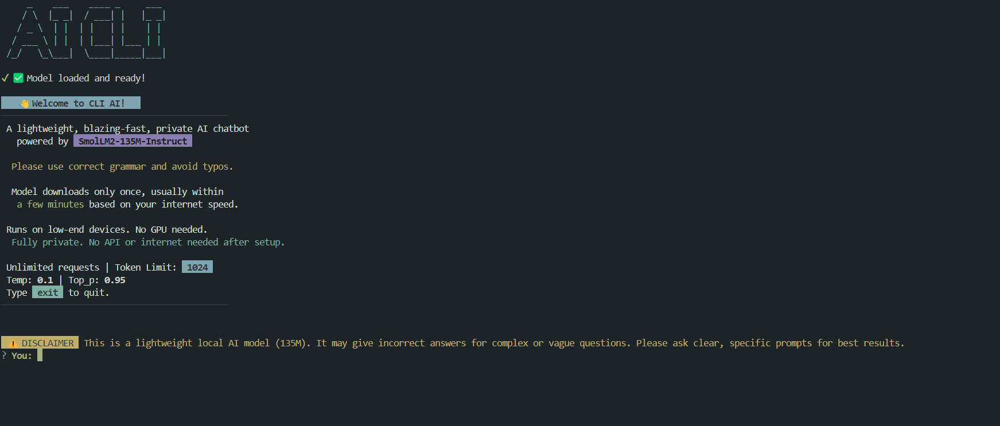

# CLI AI: Offline Terminal Chatbot Powered by Local LLM

A blazing-fast, privacy-friendly AI chatbot that runs fully offline on your terminal using the lightweight SmolLM2-135M-Instruct model.

No APIs. No rate limits. No GPU required.



# Installation

```bash
npx cli-ai-smollm2
```

# Limitations

SmolLM2 models are compact, efficient language models designed for local inference with fast performance on CPUs. While they are capable and lightweight, they come with certain limitations users should be aware of:

### Language Scope

- Primarily trained to understand and generate content in English.
- Performance on non-English prompts may be inconsistent.

### Reasoning and Accuracy

- Responses may not always be factually correct, logically consistent, or contextually relevant.
- Not suitable for tasks requiring deep reasoning, precise computation, or domain expertise (e.g., legal, financial, or medical advice).

### Bias and Fairness

- Like all language models, SmolLM2 may reflect biases present in the training data.
- May occasionally generate culturally insensitive, stereotyped, or inaccurate content.

### No Conversation Memory

- Memory
  🔒 No chat storage: This app does not retain or log any conversations.
- Use it for casual, one-off queries, playful interaction, or lightweight knowledge exploration.
- For long-term memory, summaries, or personal productivity, consider pairing with tools that support persistent chat.

# Features

- 💬 Chat with a local LLM in your terminal

- ⚡ Blazingly fast responses

- 📦 Model downloads only once

- 💻 Runs on lightweight device

- 🛡️ Fully private — no internet required after setup

- 🆓 Unlimited requests

# Tech Stack

- Transformers.js
- Node.js
- SmolLM2-135M-Instruct (135M param local instruct-tuned model)

# LICENSE

This project is licensed under the [MIT License](./LICENSE).  
Copyright © 2025 [Aditya Chaurasia](https://aditya-chaurasia.vercel.app)

Permission is hereby granted, free of charge, to any person obtaining a copy of this software and associated documentation files (the “Software”), to deal in the Software without restriction — including without limitation the rights to use, copy, modify, merge, publish, distribute, sublicense, and/or sell copies of the Software.

> THE SOFTWARE IS PROVIDED “AS IS”, WITHOUT WARRANTY OF ANY KIND, EXPRESS OR IMPLIED.
