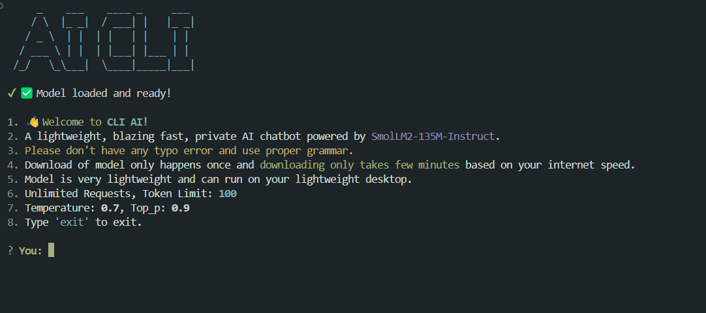

# CLI AI: Offline Terminal Chatbot Powered by Local LLM

A blazing-fast, privacy-friendly AI chatbot and file summarizer that runs fully offline on your terminal using the lightweight SmolLM2-135M-Instruct model.

No APIs. No rate limits. No GPU required.

# Features

- 💬 Chat with a local LLM in your terminal

- 📄 Summarize text files directly

- ⚡ Blazingly fast responses

- 📦 Model downloads only once

- 💻 Runs on lightweight device

- 🛡️ Fully private — no internet required after setup

- 🆓 Unlimited requests

# Tech Stack

- Transformers.js
- Node.js
- SmolLM2-135M-Instruct (135M param local instruct-tuned model)
